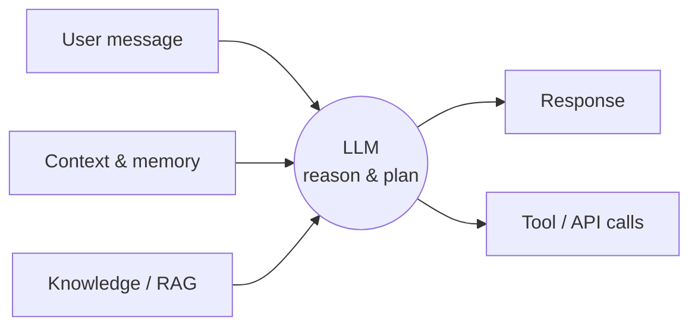
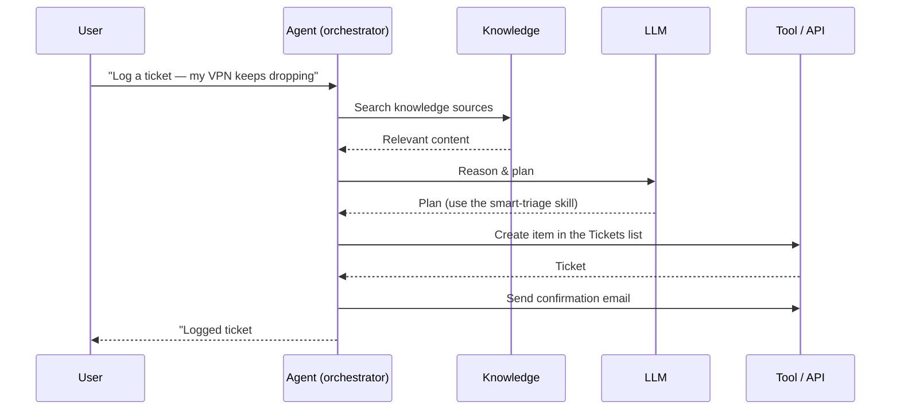
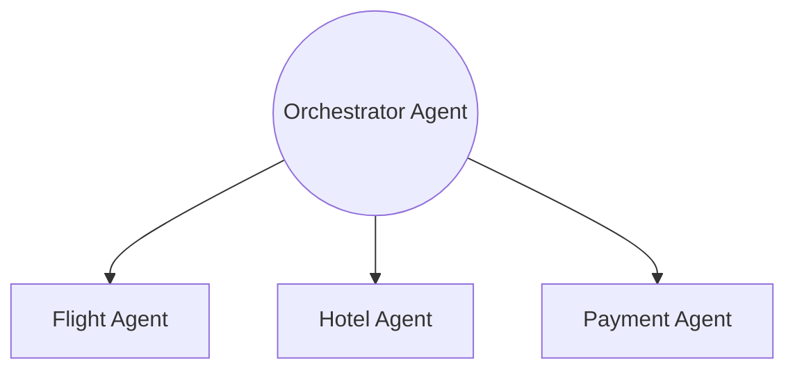

# Module 01: Introduction to Agents

**Codename:** OPERATION FIRST CONTACT  
**Time:** 20 minutes  
**Scenario:** Conceptual Foundation

---

## Learning Objectives

By the end of this module, you will understand:
- What an AI agent is and how it differs from traditional chatbots
- The core components of modern AI agents (LLMs, RAG, orchestration)
- The three types of agents you can build with Microsoft Copilot Studio
- When to use each type of agent
- The spectrum from rule-based to autonomous agents

## Overview

The term "agent" is everywhere in AI conversations today, but what does it actually mean? In this module, you'll learn the fundamental concepts behind AI agents and discover the range of agents you can build.

By the end, you'll understand why agents represent a fundamental shift in how we build software — from apps that wait for instructions to intelligent systems that can reason, plan, and act.

> 🆕 **New experience note:** Microsoft rebuilt Copilot Studio around an **enhanced, deep-reasoning orchestrator**. The concepts in this module are universal, but where the classic product used *topics and trigger phrases*, the new experience uses **Skills** (reusable markdown instructions) and lets the orchestrator decide what to do. Keep that in mind as you read.

---

## What Is an AI Agent?

An **AI agent** is an intelligent system that can:
- **Understand natural language** — users communicate in plain language, not rigid commands
- **Reason and plan** — break down complex requests into steps
- **Access knowledge** — ground responses in real data from documents, databases, and websites
- **Take actions** — call APIs, update records, send emails, and trigger workflows
- **Learn from context** — adapt responses based on conversation history and memory

### Agents vs. Traditional Chatbots

| Traditional Chatbot | AI Agent |
|---|---|
| Rule-based (if-then logic) | LLM-powered reasoning |
| Follows scripted paths | Adapts to unexpected inputs |
| Limited to predefined flows | Can handle open-ended questions |
| No memory across sessions | Maintains context and memory |
| Can only respond | Can **act** (call APIs, trigger automation) |

**Example:** A traditional chatbot might say, "I didn't understand that. Please select from these options." An AI agent will interpret the intent, search relevant knowledge sources, and respond conversationally — even if the question wasn't anticipated by the designer.

---

## The Three Core Components of AI Agents

Modern AI agents are built on three foundational technologies:

### 1. Large Language Models (LLMs)

LLMs like GPT-4.1, GPT-5, and Claude Sonnet provide the "brain" of the agent. They enable:
- Natural language understanding
- Response generation
- Reasoning and planning
- Intent classification



### 2. Retrieval-Augmented Generation (RAG)

RAG connects LLMs to **real data** — documents, databases, websites — so agents can:
- Ground responses in up-to-date information
- Cite sources for transparency
- Avoid hallucinations by using verified knowledge
- Search across SharePoint sites, Dataverse, OneDrive, and more

**How RAG works:**
1. User asks a question
2. Agent searches connected knowledge sources
3. Relevant content is retrieved
4. LLM generates a response grounded in that content

**Example:** The IT helpdesk agent searches the **Contoso IT FAQ** for "help desk hours" and returns the exact hours from the document, rather than guessing.

### 3. Orchestration and Tool Calling

Agents don't just talk — they **act**. In the new experience, the **enhanced orchestrator** plans and decides which knowledge, skills, and tools to use for each request. Orchestration allows agents to:
- Call APIs and connectors (1000+ prebuilt connectors in Power Platform)
- Trigger workflows (e.g., send approval emails, create records)
- Chain multiple actions together (multi-step plans)
- Read a data source's schema and write to it at runtime

**Example:** A user says, "My VPN keeps dropping and restarting didn't help — please log a ticket." The agent:
1. Recognizes the issue needs a ticket (its `smart-triage` skill)
2. Reads the **Tickets** SharePoint list schema
3. Creates a ticket record with the right category and priority
4. Sends the user a confirmation email with the ticket number



---

## The Three Types of Agents in Copilot Studio

Microsoft Copilot Studio lets you build three distinct types of agents, each suited to different scenarios.

### Type 1: Declarative Agents (M365 Copilot Extensions)

**What they do:** Extend Microsoft 365 Copilot with custom knowledge and skills.

**When to use:**
- Your organization uses **Microsoft 365 Copilot** licenses
- You want to add domain-specific knowledge to M365 Copilot (e.g., HR policies, product docs)
- Users should access the agent through the M365 Copilot chat interface

**Example:** An HR Policy Agent that M365 Copilot users can invoke with `@HR Policy` to ask questions about leave policies, benefits, and procedures.

**Key features:**
- Integrated into M365 Copilot interface
- Uses declarative JSON manifest
- Grounded in your organization's knowledge
- Requires M365 Copilot license

> **Note:** We'll build a declarative agent in **Module 03**.

### Type 2: Custom Conversational Agents

**What they do:** Standalone agents you build and deploy to channels like Microsoft Teams, websites, or mobile apps.

**When to use:**
- You want full control over the agent's behavior, knowledge, skills, and tools
- Users don't have M365 Copilot licenses (or you want a dedicated agent experience)
- You need advanced capabilities: skills, workflows, tools, custom branding

**Example:** The **Contoso Helpdesk Agent** you'll build in this course — a dedicated IT support agent deployed to Teams that resets passwords, troubleshoots VPN, logs tickets, and handles software requests.

**Key features:**
- Built on a single **Build** page (Instructions, Knowledge, Skills, Tools, Memory, Connected agents, Model)
- Behavior defined with natural-language **Instructions** and reusable **Skills** (markdown)
- Deploy to multiple channels (Teams, web, M365 Copilot)
- Works with or without M365 Copilot licenses

> **Note:** Most of this course focuses on building this custom conversational agent.

### Type 3: Autonomous Agents (Event-Driven)

**What they do:** Proactive agents that act **without user input** based on events, schedules, or data changes.

**When to use:**
- You need agents that monitor systems and take action automatically
- Scenarios: send alerts, process incoming data, run scheduled checks
- Background automation with intelligent decision-making

**Example:** A monitoring agent that watches the **Tickets** list for high-priority tickets and automatically escalates them to a manager if they remain unresolved.

**Key features:**
- Event-triggered (Dataverse/SharePoint changes, schedules, webhooks)
- No conversational UI required
- Can send notifications, create records, call workflows
- Combines automation + AI reasoning

> **Note:** We'll add an autonomous event trigger in **Module 10: Autonomous Event Triggers**.

---

## The Agent Autonomy Spectrum

Not all agents need the same level of autonomy. Think of agents on a spectrum:

```
Rule-Based       Generative         Autonomous
Chatbot          Assistant          Agent
    │                │                  │
    └────────────────┴──────────────────┘
    Low autonomy              High autonomy
```

- **Rule-based chatbot:** Follows predefined paths (e.g., "Press 1 for sales, 2 for support")
- **Generative assistant:** Responds conversationally, grounds in knowledge, but waits for user input
- **Autonomous agent:** Monitors, plans, and acts without prompting (e.g., auto-escalates tickets, sends reminders)

**In this course, you'll build across the spectrum:**
- Start with a conversational agent (Modules 06–09)
- Add an autonomous trigger (Module 10)
- Evaluate and publish to production channels (Module 11)

---

## Multi-Agent Orchestration (Advanced)

As you gain experience, you'll discover that **some problems are best solved by multiple specialized agents working together**, rather than one monolithic agent.

**Example:** A travel booking system might use:
- **Flight Agent** — searches flights, checks availability
- **Hotel Agent** — finds accommodations
- **Orchestrator Agent** — coordinates the other two and presents a unified itinerary

In the new experience, the **Connected agents** block on the Build page makes this concrete: one agent can **delegate** to another, calling it like a tool. You can build multi-agent solutions where:
- Each agent is an expert in one domain
- Agents call each other through **Connected agents**
- An orchestrator agent routes user requests to the right specialist



> **Note:** Multi-agent orchestration is an advanced topic. We'll point out where it lives in **Module 02** but won't build it in this course. It's part of the Special Ops curriculum.

---

## Key Concepts to Remember

Before moving forward, make sure you understand these terms:

| Term | Definition |
|---|---|
| **LLM** | Large Language Model — the AI that powers reasoning and language understanding |
| **RAG** | Retrieval-Augmented Generation — grounding agent responses in real data |
| **Orchestration** | The agent's ability to plan, call skills/tools, and chain actions |
| **Declarative Agent** | An agent that extends M365 Copilot using a JSON manifest |
| **Custom Agent** | A standalone agent built in Copilot Studio with full customization |
| **Autonomous Agent** | An event-driven agent that acts proactively without user input |
| **Skills** | Reusable instructions in markdown that define a specific behavior (the new experience's replacement for topics) |
| **Tools** | APIs, connectors, and workflows the agent can call |
| **Knowledge** | Data sources the agent searches (SharePoint, websites, files, etc.) |
| **Memory** | The agent's ability to remember context across turns and conversations |

---

## Real-World Use Cases

To ground these concepts, here are common scenarios where organizations deploy AI agents:

### IT Helpdesk Agent (This Course)
- **Knowledge:** IT FAQ, approved software list, troubleshooting guidance
- **Actions:** Reset passwords, troubleshoot VPN, log support tickets, route software requests for approval
- **Channel:** Microsoft Teams + Microsoft 365 Copilot

### HR Policy Agent
- **Knowledge:** Employee handbook, benefits docs, leave policies
- **Actions:** Answer policy questions, link to forms, escalate to HR
- **Channel:** M365 Copilot extension

### Sales Qualification Agent
- **Knowledge:** Product catalog, pricing, qualification criteria
- **Actions:** Log lead info to CRM, schedule demo, send follow-up email
- **Channel:** Website chat widget

### Facilities Monitoring Agent (Autonomous)
- **Knowledge:** Building schedules, maintenance logs
- **Actions:** Monitor room sensors, auto-create work orders, alert facilities team
- **Trigger:** Dataverse row change (temperature sensor alert)

---

## Why Agents Matter

Agents represent a shift from **apps that wait for commands** to **intelligent systems that understand, reason, and act**.

Traditional software:
1. User clicks button A
2. App executes action B
3. Result C is displayed

AI agents:
1. User describes goal in natural language
2. Agent **reasons** about the goal, **searches** for relevant info, **plans** a sequence of actions
3. Agent **executes** the plan and **explains** what it did

**The result:** Users spend less time navigating menus and more time accomplishing their goals.

---

## Key Takeaways

- **AI agents** combine LLMs, RAG, and orchestration to understand, reason, and act
- **Three types of agents:** Declarative (M365 extensions), Custom (standalone), Autonomous (event-driven)
- **RAG is essential:** Grounding agents in real data prevents hallucinations and ensures accuracy
- **Agents can act:** They don't just respond — they call skills, tools, and workflows, and update systems
- **Autonomy is a spectrum:** From rule-based chatbots to fully autonomous monitoring agents
- **The new experience uses Skills, not topics:** You describe behavior; the enhanced orchestrator decides what to do

---

## Next Steps

Now that you understand what agents are, it's time to learn how to build them.

In **Module 02: New Copilot Studio Fundamentals**, you'll explore the building blocks every agent is made of — and see exactly where they live on the new single **Build** page.

---

**Course Navigation:** [← Module 00](../00-course-setup/) | [Course Index](../) | [Next: Module 02 →](../02-copilot-studio-fundamentals/)
