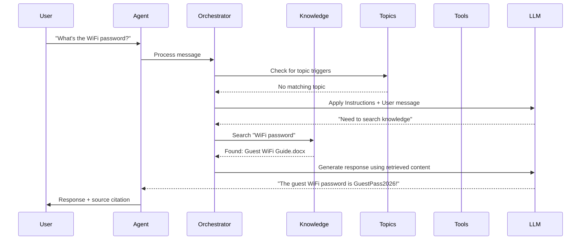
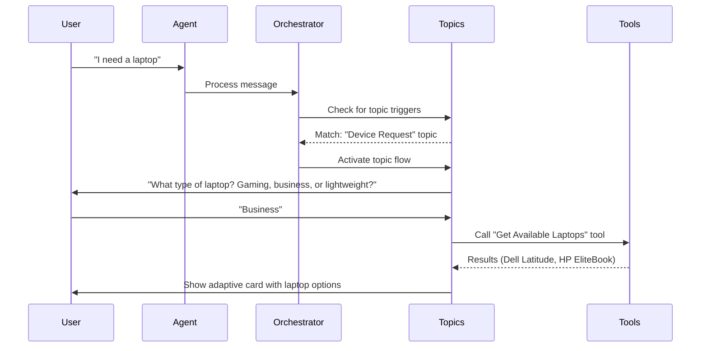

# Module 02: Copilot Studio Fundamentals

**Codename:** OPERATION CORE PROTOCOL  
**Time:** 35 minutes  
**Scenario:** Conceptual + UI Orientation

---

## Learning Objectives

By the end of this module, you will be able to:
- Navigate the Copilot Studio Overview page with confidence
- Identify the four building blocks of every agent: Knowledge, Tools, Topics, Instructions
- Understand how these building blocks work together in the agent orchestrator
- Recognize where each building block lives in the Copilot Studio UI
- Explain how agents use RAG to ground responses in real data

## Overview

Every agent in Copilot Studio is built from the same four fundamental components. Understanding these building blocks — and where they live in the interface — is the key to becoming an effective agent builder.

In this module, you'll learn:
1. **The new Copilot Studio UI** — specifically the Overview page model
2. **The four building blocks** — what they are and how they work together
3. **The orchestration flow** — how the agent decides what to do with each user message

By the end, you'll have a mental map of both the concepts **and** the interface.

---

## The Copilot Studio Overview Page

Before we dive into the four building blocks, let's orient you in the new Copilot Studio interface. When you open any agent, you'll land on the **Overview page** — this is your main authoring surface.

> **Why this matters:** Everything you build in this course lives on the Overview page. Understanding this layout now will save you time in every lab.

### What Is the Overview Page?

The Overview page is a **single scrollable canvas** showing all your agent's components at once. You no longer navigate to separate tabs for each feature — it's all visible in one view.

**Old model (pre-2025):** Multiple tabs for Topics, Actions, Settings, etc.  
**New model (current):** One Overview page with sections you scroll through.

[SCREENSHOT: Full Copilot Studio Overview page showing all sections from Details to Suggested Prompts, with Test pane on the right]

### Overview Page Layout

```
┌─────────────────────────────────────────┬─────────────────┐
│ Left Sidebar          Top Bar            │                 │
│ ─────────             ─────────          │                 │
│ 🏠 Home               [Agent Name]       │                 │
│ 🤖 Agents             [Publish] [⚙️]     │   TEST PANE     │
│ 🔗 Connections        ─────────────────  │                 │
│ ⚙️ Settings           📋 Details         │  [Type a        │
│                       Name, description  │   message...]   │
│                       ─────────────────  │                 │
│                       🤖 Select Model    │                 │
│                       GPT-4.1 [▾]        │                 │
│                       ─────────────────  │                 │
│                       📝 Instructions    │                 │
│                       "You are..."       │                 │
│                       [Edit]             │                 │
│                       ─────────────────  │                 │
│                       📚 Knowledge       │                 │
│                       ● SharePoint site  │                 │
│                       ● Document.pdf     │                 │
│                       [+ Add]            │                 │
│                       ─────────────────  │                 │
│                       🔧 Tools           │                 │
│                       [+ Add]            │                 │
│                       ─────────────────  │                 │
│                       💬 Topics          │                 │
│                       (Shows first 3)    │                 │
│                       [See all]          │                 │
│                       ─────────────────  │                 │
│                       📢 Channels        │                 │
│                       [+ Add]            │                 │
└─────────────────────────────────────────┴─────────────────┘
```

On the **right side**, you always have the **Test pane** — a live chat window for testing your agent as you build it.

### Sections on the Overview Page

Here's what each section does and which module covers it in detail:

| Section | What you do here | Corresponds to... |
|---|---|---|
| **Details** | Edit agent name and description | Module 06: Build a Custom Agent |
| **Select your agent's model** | Choose the AI model (GPT-4, GPT-5, Claude, etc.) | Module 06 |
| **Instructions** | Write the system prompt (role, persona, guidelines) | Module 06, Module 07 |
| **Knowledge** | Add SharePoint sites, documents, websites, Dataverse | Module 06 |
| **Tools** | Add connectors, agent flows, workflows, APIs | Module 09 |
| **Topics** | Create conversational flows with triggers | Module 07, Module 08 |
| **Channels** | Publish to Teams, websites, etc. | Module 11: Publishing |
| **Suggested Prompts** | Starter prompts shown to users in Teams/M365 | Module 11 |

> **💡 Tip:** You can do everything from the Overview page. You don't need to navigate away to add knowledge, create a topic, or test — it's all right here.

### Accessing Deep Views

Some sections have expanded views for detailed work:
- **Topics** → Select "See all" or select a topic name → opens the **Topic designer** (visual canvas for conversation flows)
- **Tools** → Select "See all" or select a tool → opens the **Tool editor**
- **Settings** (gear icon ⚙️ at top) → **Agent settings**: language, solution, schema, advanced options

### The Test Pane

The **Test pane** is always visible on the right side of the Overview page. Use it to:
- Send test messages to your agent
- See how the agent responds in real-time
- Verify knowledge sources are being searched
- Test tool calls and topic triggers

**New test session icon** (circular arrows): Click this to restart the conversation and clear context.

[SCREENSHOT: Test pane showing a conversation with the agent, with "New test session" icon highlighted]

### Top Action Bar

At the top right of the Overview page:
- **Publish** button — Deploy your agent to channels
- **Settings** (⚙️) — Agent-level settings
- **More options** (…) — Additional actions

---

## The Four Building Blocks

Now that you know **where** everything lives in the UI, let's learn **what** these building blocks do.

Every agent in Copilot Studio is built from four core components:

1. **Knowledge** — What the agent knows
2. **Tools** — What the agent can do
3. **Topics** — Conversational flows and triggers
4. **Instructions** — How the agent should behave

Let's explore each one.

---

## Building Block 1: Knowledge

**Knowledge** is the information your agent can search to ground its responses. This is the foundation of RAG (Retrieval-Augmented Generation).

### What Counts as Knowledge?

- **SharePoint sites** — Documents, pages, lists
- **Uploaded files** — PDFs, Word docs, PowerPoint
- **Websites** — Public URLs the agent can crawl
- **Dataverse tables** — Structured data from the Power Platform
- **Microsoft Support** (optional) — General IT troubleshooting articles
- **General web search** (toggle) — Real-time web results

[SCREENSHOT: Overview page Knowledge section showing SharePoint site, uploaded document, and "General web search" toggle enabled]

### How Knowledge Works (RAG in Action)

When a user asks a question:
1. The agent **searches** all connected knowledge sources
2. Relevant content is **retrieved** (documents, pages, list items)
3. The LLM **generates** a response grounded in that content
4. The agent **cites sources** so users can verify the information

**Example:**
- **User:** "What's the guest WiFi password?"
- **Agent searches:** SharePoint site, uploaded documents
- **Agent finds:** "Guest WiFi Connection Guide.docx" contains the password
- **Agent responds:** "The guest WiFi password is GuestPass2026! (Source: Guest WiFi Connection Guide.docx)"

### Why Knowledge Matters

Without knowledge sources:
- The agent can only respond based on the LLM's training data (which may be outdated or incorrect)
- Responses may **hallucinate** (make up plausible-sounding but false information)
- The agent can't answer domain-specific questions (e.g., your company's policies)

With knowledge sources:
- Responses are **grounded in real data**
- The agent can **cite sources** for transparency
- You control what the agent knows (and doesn't know)

> **Best practice:** Always add at least one knowledge source before deploying an agent to production.

---

## Building Block 2: Tools

**Tools** are the actions your agent can take. While knowledge is about **knowing**, tools are about **doing**.

### What Counts as a Tool?

- **Connectors** — 1000+ prebuilt integrations (SharePoint, Outlook, Teams, Dynamics 365, etc.)
- **Agent Flows** — Custom Power Automate-style workflows you build in Copilot Studio
- **Workflows** (new) — Next-generation automation canvas (public preview)
- **Custom APIs** — OpenAPI/Swagger specs for external systems
- **MCP (Model Context Protocol)** — Advanced integration for frontier models

[SCREENSHOT: Overview page Tools section showing "+ Add" button and Work IQ toggle]

### How Tools Work

The agent uses **tool calling** (also called function calling). When the agent determines an action is needed:
1. The LLM **decides** which tool to call and what parameters to pass
2. The agent **executes** the tool (e.g., sends an email, creates a record)
3. The agent **receives** the result and continues the conversation

**Example:**
- **User:** "Send me a list of available laptops."
- **Agent decides:** Call the "Get Devices from SharePoint" tool with filter: `Category = 'Laptop' AND Status = 'Available'`
- **Tool executes:** Queries the SharePoint Devices list
- **Agent responds:** "Here are the available laptops: Dell Latitude 7430, HP EliteBook 840..."

### Common Tool Use Cases

| Scenario | Tool Type |
|---|---|
| Send an email notification | Outlook connector |
| Create a support ticket | SharePoint connector (create list item) |
| Look up customer info | Dataverse connector or custom API |
| Approve a request | Agent Flow (multi-step workflow) |
| Check weather | HTTP connector (call weather API) |

> **Note:** You'll build an Agent Flow in **Module 09** that sends an email when a device is requested.

---

## Building Block 3: Topics

**Topics** are conversational flows you design to handle specific scenarios. They combine triggers, questions, responses, and actions into a visual flow.

### What Is a Topic?

A topic is a **structured conversation path** that:
- **Triggers** when the user says specific phrases (e.g., "I need a laptop")
- **Asks questions** to gather information (e.g., "What type of device do you need?")
- **Branches** based on answers (if laptop → show laptop options; if monitor → show monitor options)
- **Takes actions** (calls tools, displays adaptive cards, saves data)
- **Responds** with messages, images, or cards

[SCREENSHOT: Topic designer showing a simple flow with Trigger → Question → Condition → Message nodes]

### When to Use Topics

Use topics when you want **precise control** over a conversation flow:
- Multi-step processes (e.g., onboarding, troubleshooting wizards)
- Forms with required fields (e.g., "Request a device" with questions: Category? Justification? Urgency?)
- Conditional logic (e.g., if VIP user → escalate immediately)

**Generative vs. Topic-driven:**
- **Generative** (default): Agent uses LLM reasoning to respond — flexible, conversational, but less predictable
- **Topic-driven**: You design the exact flow — predictable, structured, but less flexible

> **Best practice:** Use topics for mission-critical flows where you need guaranteed behavior (e.g., password reset must follow exact steps). Use generative responses for open-ended Q&A.

### Triggers

Every topic has a **trigger** that tells the agent when to activate that topic. Common trigger types:
- **Phrases** — User says "reset my password" → Password Reset topic activates
- **Events** — A Dataverse record changes → Escalation topic activates
- **Proactive** — Scheduled (e.g., daily summary report)

> **Note:** In the new UI, **Triggers** also have a dedicated section on the Overview page (for event-based triggers). Phrase triggers are configured within each topic.

---

## Building Block 4: Instructions

**Instructions** are the system prompt that defines your agent's personality, role, and behavior. This is where you tell the agent **who it is** and **how it should act**.

### What Goes in Instructions?

Instructions typically include:
- **Role/persona** — "You are a helpful IT support assistant..."
- **Tone and style** — "Be polite, concise, and professional."
- **Guidelines** — "Always cite sources. If you don't know, say so."
- **Constraints** — "Do not discuss non-IT topics."
- **Memory/context rules** — "Remember the user's name and previous requests."

[SCREENSHOT: Overview page Instructions section showing "You are a helpful IT assistant..." with Edit button]

### Example Instructions

Here's the instruction set for the **Contoso Helpdesk Agent** you'll build:

```
You are an IT Help Desk assistant that helps Contoso employees resolve common IT issues 
and find available devices. Be polite, concise, and helpful. 

When answering questions:
- Search the Contoso IT SharePoint site first
- Cite sources when providing information
- If you don't know the answer, say so and suggest contacting IT support

When helping with device requests:
- Search the Devices list for available options
- Show device details (brand, model, location)
- If requested, trigger the device request flow

Do not:
- Discuss topics outside of IT support
- Make up information — always ground responses in knowledge sources
- Share sensitive information like passwords in chat (link to documents instead)
```

### Why Instructions Matter

Instructions shape the agent's behavior. Without clear instructions:
- The agent may respond off-topic
- Tone may be inconsistent (formal in one message, casual in another)
- The agent may hallucinate instead of admitting "I don't know"

With well-written instructions:
- The agent stays on-brand and on-topic
- Users get a consistent experience
- The agent knows when to escalate or defer

> **Best practice:** Test your instructions by asking edge-case questions. Does the agent stay in character? Does it gracefully handle questions outside its scope?

---

## How the Four Building Blocks Work Together

Now let's see how all four components combine to create an intelligent conversation.

### The Agent Orchestration Flow

When a user sends a message, here's what happens inside the agent:



**Step-by-step:**
1. **User sends message** → "What's the WiFi password?"
2. **Orchestrator checks topics** → Are there any topics triggered by this phrase?
   - If yes → Follow the topic flow
   - If no → Continue to generative response
3. **Orchestrator applies instructions** → "You are an IT assistant... search SharePoint first..."
4. **LLM decides** → "I should search knowledge sources for 'WiFi password'"
5. **Orchestrator searches knowledge** → Retrieves "Guest WiFi Connection Guide.docx"
6. **LLM generates response** → Grounded in the retrieved document
7. **Agent responds** → With answer + citation

### When Topics Take Over

If the user says a **trigger phrase** (e.g., "I need a laptop"), the flow changes:



**Key difference:** When a topic is triggered, the **topic flow** controls the conversation, not the LLM's generative reasoning. You get predictable, step-by-step behavior.

---

## The New Terminology: Tools (Not Actions)

If you've used Copilot Studio before, you may have seen **"Actions"** in the old UI. The new UI calls this section **"Tools"**.

**Why the change?**
- **Tools** aligns with industry-standard LLM terminology (tool calling, function calling)
- **Actions** was ambiguous (could mean UI actions, user actions, automation actions)

The concept is the same — these are the things your agent can **do**.

---

## Triggers: Now a First-Class Section

In the new Overview page, **Triggers** has its own section (separate from Topics). This is for **event-based triggers** that make agents autonomous.

**Phrase triggers** (conversational) are still configured inside each topic.  
**Event triggers** (autonomous) are configured in the Triggers section.

**Example event triggers:**
- **Dataverse row added** → When a new support ticket is created
- **Schedule** → Every Monday at 9 AM
- **Webhook** → External system sends a signal

> **Note:** You'll explore event triggers in **Module 10: Add Event Triggers**.

---

## AI Model Selection

On the Overview page, you'll see **"Select your agent's model"** — a dropdown to choose the AI model that powers your agent's reasoning.

**Available models** (as of June 2026):
- **GPT-4.1** (default) — Reliable, fast, cost-effective
- **GPT-5** — Advanced reasoning, longer context
- **Claude Sonnet 4.5 / 4.6** — Strong at structured tasks, citations
- **Mistral Medium 3.5** — Multilingual, efficient

**When to change the model:**
- **Complex reasoning** → GPT-5 or Claude Sonnet 4.6
- **Cost-sensitive** → GPT-4.1
- **Multilingual** → Mistral Medium
- **Long documents** → Models with large context windows

> **Tip:** For this course, the default **GPT-4.1** is perfectly fine. You can experiment with other models later.

---

## Key Takeaways

- **Overview page** = single scrollable canvas with all agent components visible at once
- **Four building blocks:**
  1. **Knowledge** — What the agent knows (SharePoint, docs, websites)
  2. **Tools** — What the agent can do (connectors, flows, APIs)
  3. **Topics** — Structured conversation flows with triggers
  4. **Instructions** — System prompt defining role, tone, behavior
- **Orchestrator** = the brain that decides when to search knowledge, call tools, or follow topics
- **RAG** = Retrieval-Augmented Generation — grounding responses in real data
- **Test pane** = always visible on the right; use it constantly while building
- **Triggers** = now a first-class section for event-based autonomous behaviors

---

## What You've Learned

You now have a mental map of:
- **Where** everything lives in Copilot Studio (the Overview page layout)
- **What** the four building blocks are and how they work together
- **How** the orchestrator decides what to do with each user message
- **Why** RAG is essential for accurate, grounded responses

---

## Next Steps

In **Module 03: Create a Declarative Agent for M365 Copilot**, you'll build your first agent — a lightweight extension for Microsoft 365 Copilot users.

Then in **Module 06**, you'll build the **Contoso Helpdesk Agent** from scratch, adding knowledge sources, topics, tools, and instructions step-by-step.

---

**Course Navigation:** [← Module 01](../01-introduction-to-agents/README.md) | [Course Index](../README.md) | [Next: Module 03 →](../03-declarative-agent-m365/README.md)
