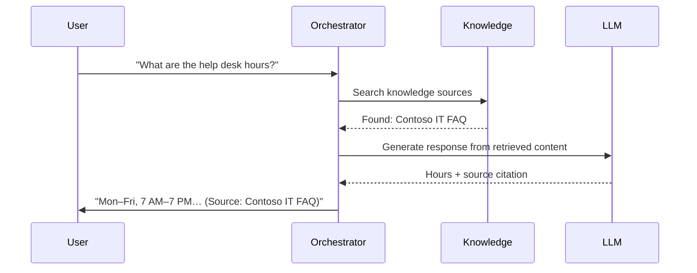
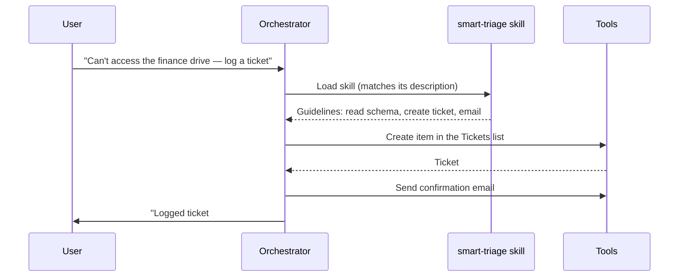

# 🧱 Module 02: New Copilot Studio Fundamentals

**Codename:** OPERATION CORE PROTOCOL  
**Time:** 35 minutes  
**Scenario:** Conceptual + UI Orientation

---

## 🎯 Learning Objectives

By the end of this module, you will be able to:
- Navigate the new Copilot Studio **Build page** with confidence
- Identify the building blocks of every agent: Instructions, Knowledge, Skills, Tools, Memory, Connected agents, and Model
- Understand how these building blocks work together through the enhanced orchestrator
- Recognize where each building block lives in the new interface
- Explain how agents use RAG to ground responses, and how Skills replace topics

## 🧭 Overview

Every agent in the new Copilot Studio is built from the same set of building blocks, all visible on a single **Build page**. Understanding these blocks — and where they live in the interface — is the key to becoming an effective agent builder.

In this module, you'll learn:
1. **The new Copilot Studio UI** — specifically the single Build page
2. **The building blocks** — what they are and how they work together
3. **The orchestration flow** — how the enhanced orchestrator decides what to do with each user message

By the end, you'll have a mental map of both the concepts **and** the interface.

> 🆕 **If you've used classic Copilot Studio:** the old "four building blocks" included **Topics** (visual conversation flows with trigger phrases). The new experience has **no topics and no trigger phrases**. Their job is now done by **Skills** (reusable markdown instructions) and the enhanced orchestrator. We'll call that out as we go.

---

## 🖥️ The Copilot Studio Build Page

When you open an agent in the new experience, you land on the **Build page** — your main authoring surface. Everything about the agent lives here, in one place.

> **Why this matters:** Everything you build in this course lives on the Build page. Understanding this layout now will save you time in every lab.

### What Is the Build Page?

The Build page is a **single canvas** showing all your agent's components at once. You don't navigate to separate tabs for each feature — Instructions, Knowledge, Skills, Tools, Memory, Connected agents, and Model are all visible together, with a live **Test/Preview pane** beside them.

**Classic model:** Multiple tabs / an Overview page built around Topics and Actions.  
**New model:** One **Build** page built around Instructions, Knowledge, **Skills**, Tools, **Memory**, **Connected agents**, and **Model**.

[SCREENSHOT: Full Copilot Studio Build page showing the Instructions, Knowledge, Skills, Tools, Memory, Connected agents and Model blocks, with the Preview pane on the right]

### Build Page Layout

```
┌─────────────────────────────────────────┬─────────────────┐
│ Top Bar                                  │                 │
│ [Agent Name]            [Publish] [⚙️]   │                 │
│ ───────────────────────────────────────  │                 │
│ 📋 Details — name, icon, description     │   PREVIEW       │
│ ───────────────────────────────────────  │   PANE          │
│ 📝 Instructions — identity & rules       │                 │
│ ───────────────────────────────────────  │  [greeting]     │
│ 📚 Knowledge — docs, SharePoint, web     │  [suggested     │
│ ───────────────────────────────────────  │   prompts]      │
│ 🧠 Skills — reusable markdown behaviors  │                 │
│ ───────────────────────────────────────  │  [Type a        │
│ 🔧 Tools — connectors, workflows, MCP    │   message...]   │
│ ───────────────────────────────────────  │                 │
│ 💾 Memory — remember context             │  (maker vs.     │
│ ───────────────────────────────────────  │   end-user      │
│ 🤝 Connected agents — delegate to others │   toggle)       │
│ ───────────────────────────────────────  │                 │
│ 🤖 Model — the AI that powers reasoning  │                 │
└─────────────────────────────────────────┴─────────────────┘
```

On the **right side** you always have the **Preview pane** — a live chat window for testing your agent as you build it.

### Blocks on the Build Page

Here's what each block does and which module covers it in detail:

| Block | What you do here | Covered in... |
|---|---|---|
| **Instructions** | The agent's identity, tone, scope, and core rules | Module 06 |
| **Knowledge** | Add documents, SharePoint, OneDrive, websites, Microsoft IQ | Module 06 |
| **Skills** | Author reusable markdown behaviors (replaces topics) | Module 07 |
| **Tools** | Add connectors, workflows, MCP servers, REST APIs | Module 07, Module 09 |
| **Memory** | Let the agent remember context across turns and conversations | Module 06 |
| **Connected agents** | Delegate to another agent (multi-agent) | (introduced here) |
| **Model** | Choose the AI model that powers reasoning | Module 06 |

> **💡 Tip:** You can do everything from the Build page — add knowledge, author a skill, equip a tool, and test — without navigating away.

### The Preview Pane

The **Preview pane** is always visible on the right side of the Build page. Use it to:
- Send test messages to your agent
- See how the agent responds in real time
- Watch the orchestrator **search knowledge, load skills, and call tools**
- Toggle **maker vs. end-user** view — as the maker you see the agent's reasoning (search → skill load → answer); end-user view shows the clean, user-facing experience

[SCREENSHOT: Preview pane showing a conversation, with the maker-vs-end-user toggle highlighted]

### Top Action Bar

At the top right of the Build page:
- **Publish** button — deploy your agent to channels
- **Settings** (⚙️) — agent-level settings: language, solution, moderation, authentication
- **More options** (…) — additional actions

---

## 🧱 The Building Blocks

Now that you know **where** everything lives, let's learn **what** these blocks do. We'll go deep on the four you'll use most — **Instructions, Knowledge, Skills, Tools** — then cover **Memory, Connected agents, and Model**.

---

## 🧱 Building Block 1: Instructions

**Instructions** define your agent's identity, personality, role, and the rules that matter most. This is where you tell the agent **who it is** and **how it should act** — in plain language.

### What Goes in Instructions?

- **Role/persona** — "You are the IT support agent for Contoso employees..."
- **Tone and style** — "Be friendly, concise, and practical."
- **Core rules** — "If an issue needs admin access, log a ticket and hand it to the help desk."
- **Guardrails** — "Never ask for passwords or one-time codes. Never help bypass security."

[SCREENSHOT: Build page Instructions block showing the Contoso Helpdesk Agent instructions with the Save button]

### Example Instructions

Here's the instruction set for **Bit**, the Contoso Helpdesk Agent you'll build:

```text
You are Bit, the IT support agent for Contoso employees. Your job is to help
employees solve common device, access, and software issues. Be friendly,
concise, and practical. If an issue needs admin access, log a ticket and hand
it to the help desk team. Never ask for passwords or one-time codes, and never
help bypass security.
```

> **Keep instructions short.** In the new experience, the detailed playbooks (how to reset a password, how to triage a ticket) live in **Skills**, not in the instructions. Instructions set identity and guardrails; skills carry the step-by-step behavior.

---

## 🧱 Building Block 2: Knowledge

**Knowledge** is the information your agent can search to ground its responses. This is the foundation of RAG (Retrieval-Augmented Generation).

### What Counts as Knowledge?

- **Uploaded files** — Word, PDF, PowerPoint
- **SharePoint sites** and **OneDrive** libraries
- **Public websites** — URLs the agent can search
- **Microsoft IQ** — organizational M365 data

[SCREENSHOT: Build page Knowledge block showing two uploaded documents (Contoso IT FAQ and Approved Software List)]

### How Knowledge Works (RAG in Action)

When a user asks a question:
1. The agent **searches** all connected knowledge sources
2. Relevant content is **retrieved** (documents, pages, list items)
3. The LLM **generates** a response grounded in that content
4. The agent can **cite sources** so users can verify the information

**Example:**
- **User:** "What are the help desk hours?"
- **Agent searches:** the uploaded knowledge documents
- **Agent finds:** the **Contoso IT FAQ** contains the hours
- **Agent responds:** "The help desk is open Mon–Fri, 7:00 AM–7:00 PM local; high-priority issues are monitored 24/7. (Source: Contoso IT FAQ)"

> **Best practice:** Always add at least one knowledge source before deploying an agent to production. Without grounding, the agent can only rely on the model's training data — which may be outdated or hallucinated.

---

## 🧱 Building Block 3: Skills

**Skills are the headline of the new Copilot Studio.** A **skill** is a set of **reusable instructions written in markdown** that defines a specific behavior — *when* it should activate, the *guidelines* to follow, *examples*, and *notes*. The orchestrator loads the right skill at the right moment.

> 🔁 **Skills replace topics.** Where the classic product had visual topic flows with trigger phrases, the new experience has skills. You no longer draw a flow or list trigger phrases — you **describe** the behavior in markdown, and the orchestrator decides when to use it.

### Anatomy of a Skill

- **Name** — all lowercase, hyphens not underscores (e.g. `password-reset`)
- **Description** — *what it does and when it should activate* (this is how the orchestrator picks it)
- **Instructions** (markdown) — typically **when to activate**, **guidelines**, **examples**, and **notes**

[SCREENSHOT: Build page Skills block showing four skills: password-reset, vpn-troubleshooting, smart-triage, software-installation-request]

### Why Skills Are Powerful

- **Reusable & portable** — upload a skill, build one from blank, or **download** a skill to reuse in another agent (you can even bring in GitHub Copilot / Claude Code skills)
- **Readable** — they're just markdown, so they're easy to review, version, and share
- **Composable** — one skill can hand off to another (e.g. `vpn-troubleshooting` → `smart-triage` to log a ticket)

> 🧰 Agents also have **built-in skills** out of the box — including ones that read **Word, PowerPoint, and PDF** files. You'll build four custom skills for the Contoso Helpdesk Agent in **Module 07**.

---

## 🧱 Building Block 4: Tools

**Tools** are the actions your agent can take. While knowledge is about **knowing** and skills describe **what to do**, tools provide the **muscle** to actually do it.

### What Counts as a Tool?

- **Connectors** — 1000+ prebuilt integrations (SharePoint, Outlook, Teams, Dynamics 365, etc.)
- **Workflows** — the new automation designer (e.g. a manager-approval process)
- **MCP servers** — Model Context Protocol integrations
- **REST APIs** — OpenAPI/Swagger specs for external systems
- **Prompts** — reusable prompt-based tools

[SCREENSHOT: Build page Tools block showing the "+ Add a tool" button and connector options]

### How Tools Work

The orchestrator decides when to call a tool based on the conversation, the agent's instructions, your **skills**, and each tool's **description** — there are no manual triggers.

1. The orchestrator **decides** which tool to call and what inputs to pass (it can **let AI fill the inputs** from context)
2. The agent **executes** the tool (e.g., creates a SharePoint item, sends an email)
3. The agent **receives** the result and continues the conversation

**Example:**
- **User:** "My account can't access the finance drive — please log a ticket."
- **Orchestrator decides:** use the `smart-triage` skill → call the **SharePoint → Create item** tool
- **Tool executes:** creates a row in the **Tickets** list
- **Agent responds:** "I've logged ticket #1234 (Access, High priority) and emailed you the details."

### Common Tool Use Cases

| Scenario | Tool Type |
|---|---|
| Send an email confirmation | Office 365 Outlook connector |
| Create a support ticket | SharePoint connector (Create item) |
| Look up a user's manager | Office 365 Users connector |
| Run a manager approval | Workflow (new designer) |

> **Note:** You'll equip the Outlook and SharePoint tools in **Module 07**, and build an approval **Workflow** in **Module 09**.

---

## 🧱 The Remaining Blocks: Memory, Connected Agents, Model

### Memory

**Memory** lets the agent remember context across turns — and across conversations — for better follow-ups. Turn it on from the Memory block. You'll enable it in **Module 06**.

### Connected Agents

**Connected agents** is how one agent **delegates** to another — agent-to-agent hand-off. This is the new experience's answer to multi-agent orchestration: one agent calls another like a tool. (Introduced in Module 01; not deep-dived in this course — it's part of the Special Ops curriculum.)

### Model

The **Model** block lets you choose the AI model that powers the agent's reasoning. More on this below.

---

## 🧱 How the Building Blocks Work Together

Now let's see how these components combine into an intelligent conversation. The **enhanced orchestrator** is the brain that decides, for each message, whether to search knowledge, load a skill, or call a tool.

### Flow 1: A Grounded Answer (Knowledge)

When a user asks a question the agent can answer from its documents:



**Step-by-step:**
1. **User sends a message** → "What are the help desk hours?"
2. **Orchestrator applies instructions** and decides knowledge is needed
3. **Orchestrator searches knowledge** → retrieves the Contoso IT FAQ
4. **LLM generates a response** grounded in the retrieved content
5. **Agent responds** with the answer + citation

### Flow 2: A Skill Takes Action

When the request needs a defined behavior plus a real action:



**Key difference from classic:** there's no topic flow and no trigger phrase. The orchestrator **selects the skill by its description**, follows the skill's markdown guidelines, and calls the tools the skill references. You describe intent; the orchestrator plans the steps.

---

## 🆕 New Terminology (If You've Used Classic)

| Classic term | New experience |
|---|---|
| **Topics** (visual flows + trigger phrases) | **Skills** (reusable markdown behaviors) |
| **Actions** | **Tools** |
| **Agent Flows** | **Workflows** (new designer) |
| Configurable orchestration toggle | **Enhanced orchestration** (always on) |
| Overview page / multiple tabs | One **Build** page |

The concepts of *knowing* (Knowledge) and *doing* (Tools) carry over — but how you define behavior changed from drawing flows to writing skills.

---

## ⚡ Autonomous Triggers

Conversational behavior comes from Skills + the orchestrator — there are no phrase triggers to configure. But agents can also act **autonomously**, driven by **event triggers** (a new row in a list, a schedule, a webhook) rather than a user message.

**Example event triggers:**
- **Row added** → a new high-priority ticket is created
- **Schedule** → every Monday at 9 AM
- **Webhook** → an external system sends a signal

> **Note:** You'll add an autonomous event trigger in **Module 10: Autonomous Event Triggers**.

---

## 🤖 AI Model Selection

The **Model** block lets you choose the AI model that powers your agent's reasoning.

**Available models** (as of June 2026):
- **GPT-4.1** (default) — reliable, fast, cost-effective
- **GPT-5** — advanced reasoning, longer context
- **Claude Sonnet 4.5 / 4.6** — strong at structured tasks and citations
- **Mistral Medium 3.5** — multilingual, efficient

**When to change the model:**
- **Complex reasoning** → GPT-5 or Claude Sonnet 4.6
- **Cost-sensitive** → GPT-4.1
- **Multilingual** → Mistral Medium

> **Tip:** For this course, the default **GPT-4.1** is perfectly fine. You can experiment with other models later.

---

## 🧠 Key Takeaways

- **Build page** = single canvas with all agent components visible at once
- **Building blocks:**
  1. **Instructions** — identity, tone, and core rules
  2. **Knowledge** — what the agent knows (docs, SharePoint, web, Microsoft IQ)
  3. **Skills** — reusable markdown behaviors (the replacement for topics)
  4. **Tools** — what the agent can do (connectors, workflows, MCP, APIs)
  5. **Memory**, **Connected agents**, **Model** — remember context, delegate, and choose the brain
- **Enhanced orchestrator** = the brain that decides when to search knowledge, load a skill, or call a tool
- **RAG** = Retrieval-Augmented Generation — grounding responses in real data
- **Preview pane** = always visible; use the maker view to watch the agent reason
- **No topics, no trigger phrases** — you describe behavior and the orchestrator decides

---

## 🎓 What You've Learned

You now have a mental map of:
- **Where** everything lives in the new Copilot Studio (the Build page layout)
- **What** the building blocks are and how they work together
- **How** the enhanced orchestrator decides what to do with each user message
- **Why** RAG is essential, and how **Skills** replace topics

---

## ⏭️ Next Steps

In **Module 03: Create a Declarative Agent for M365 Copilot**, you'll build your first agent — a lightweight extension for Microsoft 365 Copilot users.

Then in **Module 06**, you'll build the **Contoso Helpdesk Agent** from scratch — adding instructions, knowledge, skills, tools, and memory step by step.

---

**Course Navigation:** [← Module 01](../01-introduction-to-agents/) | [Course Index](../) | [Next: Module 03 →](../03-declarative-agent-m365/)
